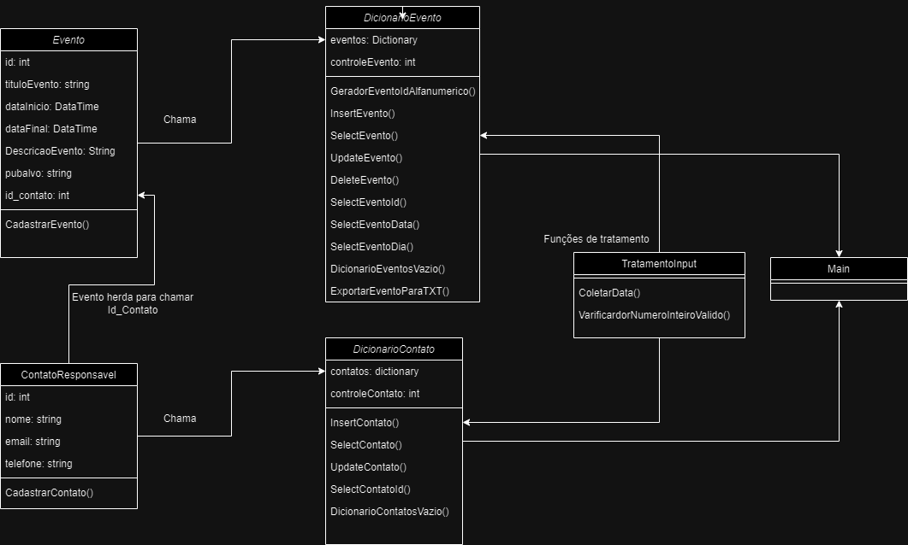

# GerenciadorEventosConsole

Avaliação processual do ano de 2024 - Sistemas de informação MULTIVIX Grupo: Diogo Lima, Gellyorge Marvila, Joas Neves, Paulo Roberto e Carlos Ribeiro

Este projeto foi desenvolvido como parte de um trabalho de faculdade. Ele consiste na criação de uma aplicação de console em C# para gestão de eventos. O Sistema permite registrar:

- Título do Evento; 
- Data, hora inicial e hora final do evento; 
- Descrição do evento; 
- Quantidade aproximada/prevista de pessoas do evento; 
- Público alvo do evento; 
- Contato responsável do evento;

## Documentação

#### Menu e suas opções

| input   | ação       | Descrição                           |
| :---------- | :--------- | :---------------------------------- |
| `1` | `Cadastro` | Cadastrar um contato |
| `2` | `exibir` | Listar contatos |
| `3` | `Cadastro` | Cadastrar um Evento |
| `4` | `exibir` | Listar eventos |
| `5` | `apagar` | apagar evento pelo id |
| `6` | `atualizar` | atualizar um contato |
| `7` | `atualizar` | atualizar um evento |
| `8` | `exportar` | exportar evento em txt |
| `9` | `exibir` | exibir eventos por periodo |
| `10` | `exibir` | exibir eventos por dia |

## Diagrama de classes 

